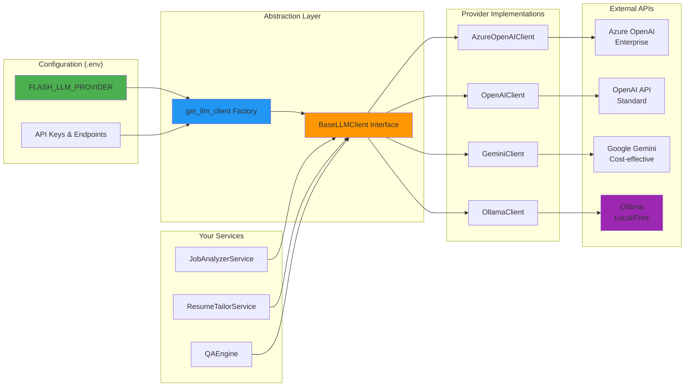
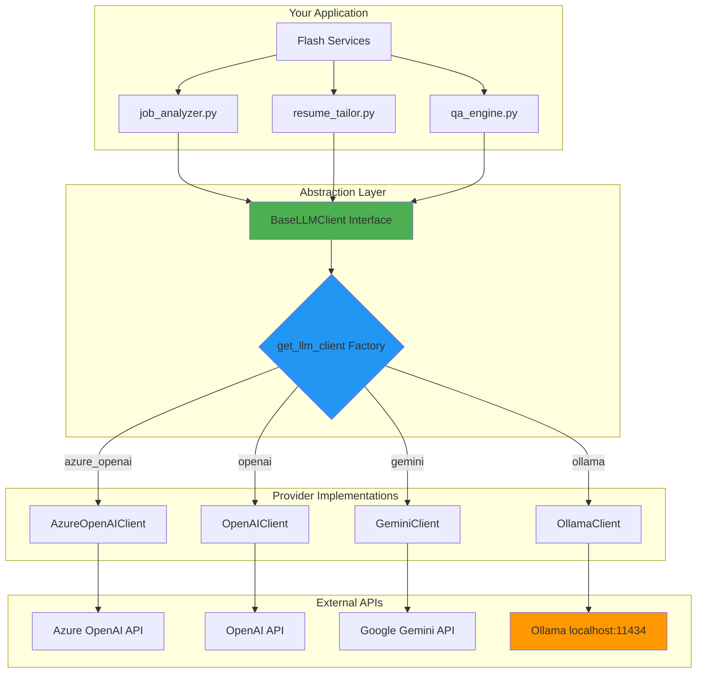
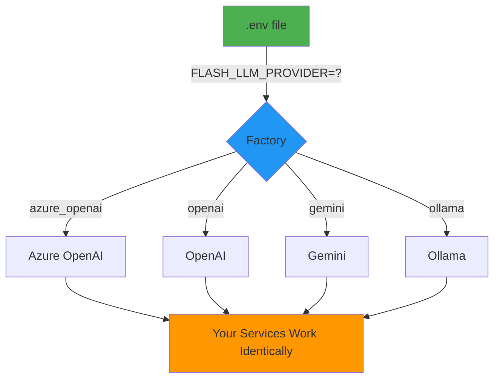
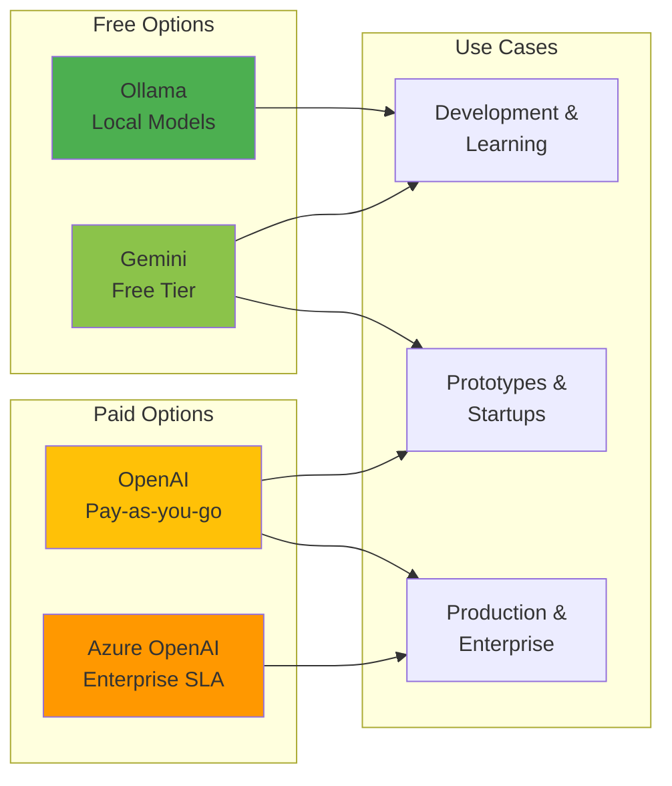
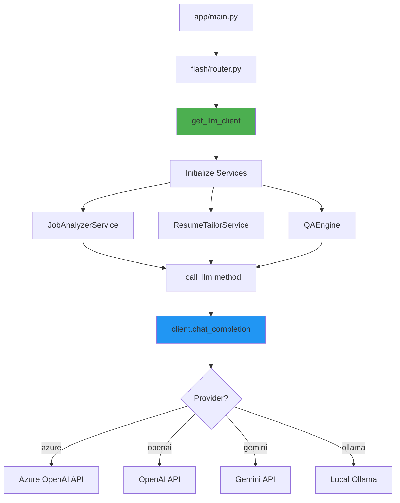

# Flash Service - Architecture Diagrams

This document contains visual architecture diagrams for the Flash LLM integration.

---

## Multi-Provider LLM Architecture

This diagram shows how the Flash service connects to different LLM providers through a unified abstraction layer:

**Key Components:**

- **Configuration Layer**: Environment variables control which provider to use
- **Abstraction Layer**: `BaseLLMClient` interface and factory pattern
- **Provider Implementations**: Concrete implementations for each LLM provider
- **Services**: Your business logic that uses the LLM
- **External APIs**: The actual LLM provider endpoints

---

## Detailed Service Flow

This diagram shows the complete flow from the application layer to external LLM APIs:

**Flow Description:**

1. **Services** call the abstract `BaseLLMClient` interface
2. **Factory** determines which provider to use based on configuration
3. **Provider Implementation** translates the request to provider-specific format
4. **External API** processes the request and returns response
5. Response flows back through the same path to the service

---

## Configuration-Driven Selection

Simple diagram showing how a single environment variable controls everything:

**Key Insight:** Change one variable, restart the server, and you're using a different provider. No code changes required!

---

## Provider Comparison at a Glance

---

## Integration Points

Shows where the LLM client is integrated into the Flash service:

---

## Viewing These Diagrams

These diagrams use Mermaid syntax and can be viewed in:

- **GitHub**: Renders automatically in markdown files
- **VS Code**: Install "Markdown Preview Mermaid Support" extension
- **Mermaid Live Editor**: https://mermaid.live/
- **Many other markdown viewers**: Most modern markdown tools support Mermaid

---

## Editing These Diagrams

To modify these diagrams:

1. Copy the mermaid code block
2. Paste into https://mermaid.live/
3. Edit visually
4. Copy the updated code back here

Or edit the text directly - Mermaid uses a simple text-based syntax.

---

## Additional Resources

- **Mermaid Documentation**: https://mermaid.js.org/
- **Diagram Types**: Flowcharts, Sequence, Class, State, Gantt, and more
- **Live Editor**: https://mermaid.live/
